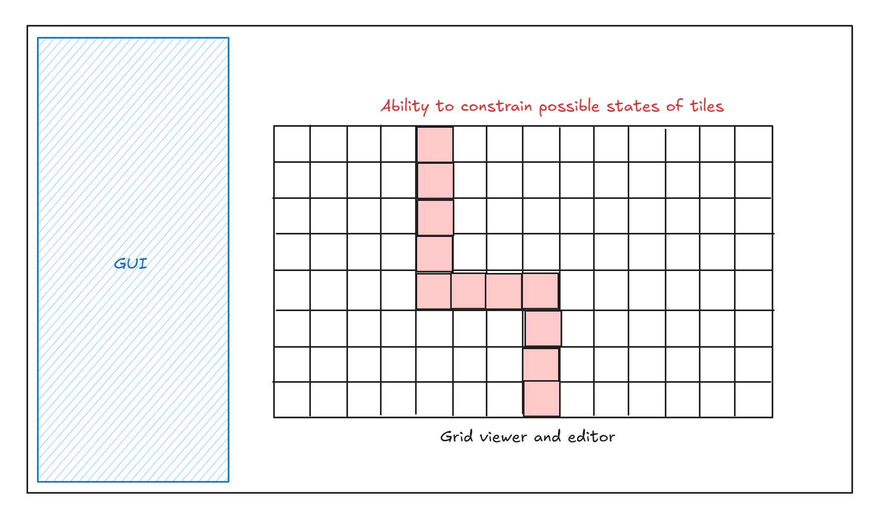
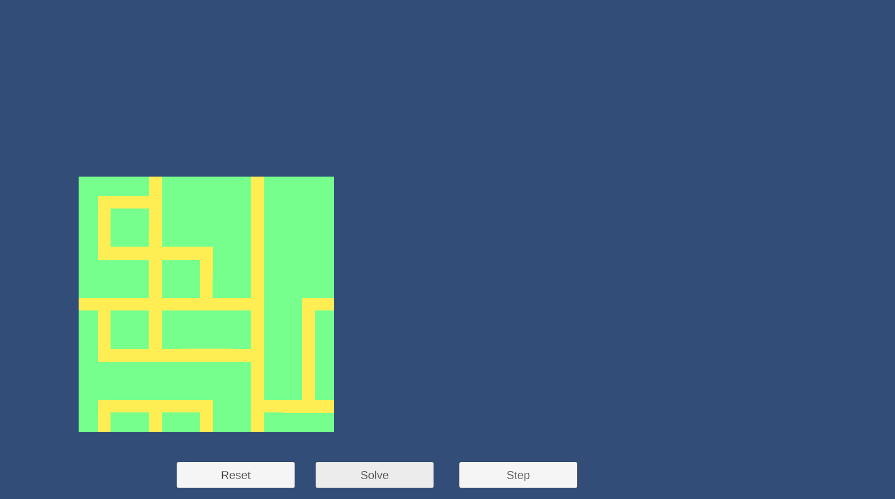
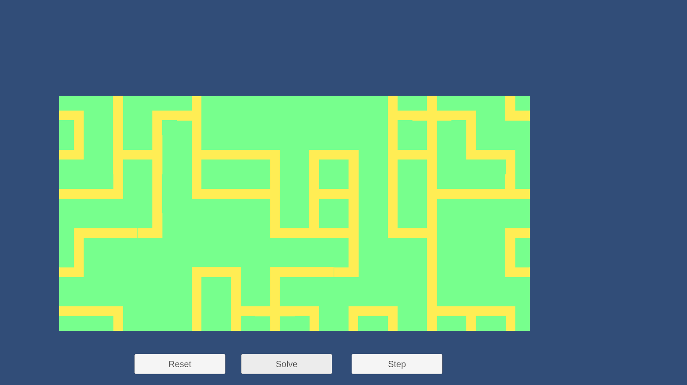
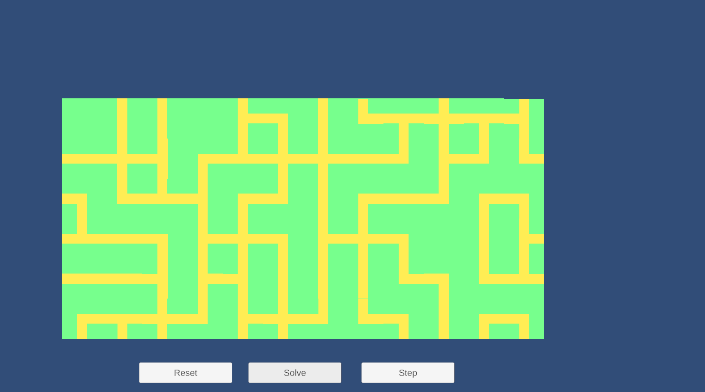
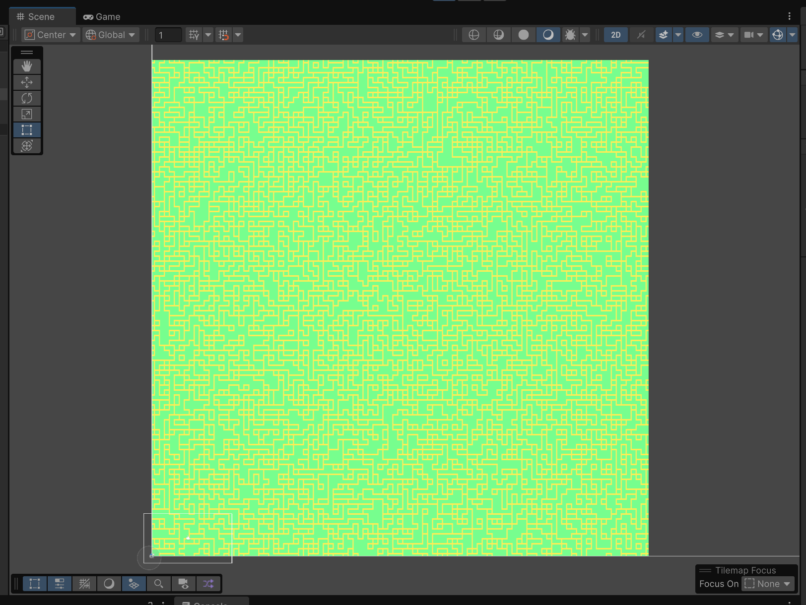
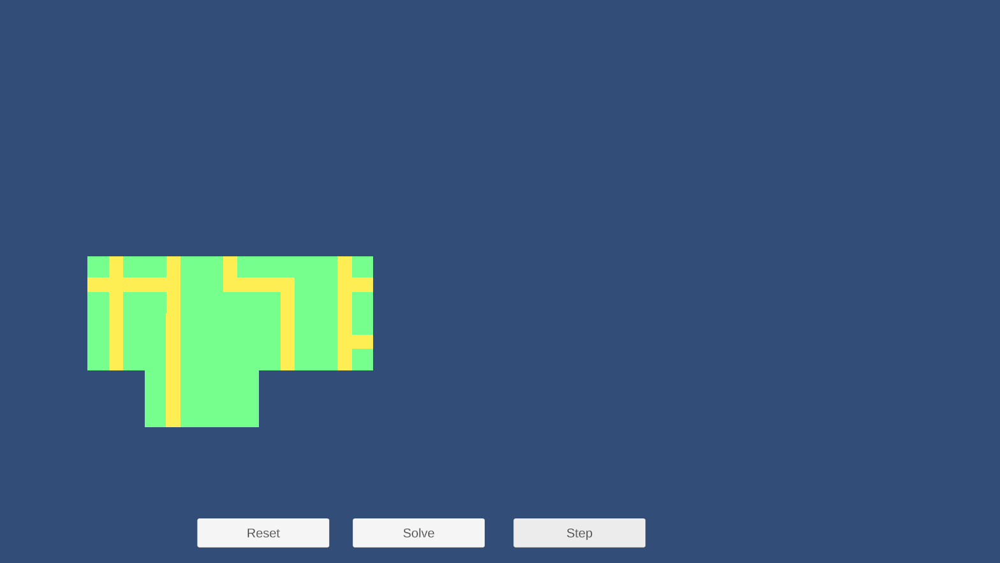

# CelesteWFC

## Introduction/motivations

I love Celeste. Everything about the game is great: the pixel art, the music, the gameplay, the story. One of the best parts of the game are the levels. They are designed so well and I can't believe that they're tile based because everything looks so natural.

Celeste is the perfect candidate for exploring wave function collapse, due to its reliance on a grid system. I always thought WFC sounded cool as heck and wanted to try implementing it on my own. What better way to do so than to use one of the best platformers of all time _[citation needed]_?

## Goal

- Learn in detail how wave function collapse works and how to implement it 
- Write well-structured, performant, and idomatic C# code
- Work more with 2D Unity, including tilemaps and player movement

## Inspiration/references

These links helped me decide on this project and will guide me through the process:

- [Celeste Tilesets, Step-by-Step (article)](https://aran.ink/posts/celeste-tilesets)
- [Why I use Wave Function Collapse to create levels for my game (video)](https://www.youtube.com/watch?v=TO0Tx3w5abQ)
- [Superpositions, Sudoku, the Wave Function Collapse algorithm. (video)](https://www.youtube.com/watch?v=2SuvO4Gi7uY)
- [EPC2018 - Oskar Stalberg - Wave Function Collapse in Bad North (video)](https://www.youtube.com/watch?v=0bcZb-SsnrA)
- [Paul Merrell, "Example-Based Model Synthesis" (2007)](https://paulmerrell.org/wp-content/uploads/2021/06/model_synthesis.pdf)
- [mxgnm / WaveFunctionCollapse (repo)](https://github.com/mxgmn/WaveFunctionCollapse)
- [Recreating Celeste's Movement | Mix and Jam (video)](https://www.youtube.com/watch?v=STyY26a_dPY)

## Specification

There are three overarching parts of this project:

- C# implementation of WFC, most likely customized for Celeste's purposes
- Celeste-specific
  - Includes at least Chapter 1's "Forsaken City" tileset
  - Preset that constrains the grid to be exactly that of Celeste's
- Grid editor/viewer GUI
  - Ability to specify number of grid columns and rows
  - Ability to click a tile to constrain it to a limited number of states (e.g. forcing a path to be carved out)
  - Ability to zoom in/out and pan around the grid/output

### Stretch goals

I have some ideas on additional features if I have more time:

- Ability to export/download finished output as a single image
- Generate more levels using different tilesets
- Performance improvements beyond the naive implementation
- Allowing the user to give an _example_ input which the algorithm uses instead to build its ruleset, generating levels from that instead
- Porting the project to browser via WebGL
- Loading the generated output as an actual custom map in Celeste via [Everest](https://everestapi.github.io/), a community mod loader

## Techniques

This project is specifically about wave function collapse so that's the algorithmic technique I'm focusing on. In particular, I'll be reading Paul Merell's specification from his original 2007 i3D paper (linked above) as well as Maxim Gumin's work, which introduced the name "wave function collapse" for the algorithm and popularized it (the original repo is also linked above).

I've already watched the videos I linked above. I think they provided me a more intuitive understanding of the repo and I'll probably revisit them if I become confused by the more technical jargon of the papers. Also, the video themselves reference the original papers and provide me a good overview of how/where to start.

The article on Celeste's tileset was useful in understanding the rules behind how Celeste laid out its levels. This will be used for developing the ruleset.

## Design

This is how I imagine the application will look like:

## Timeline

- Milestone 1 (11/13)
  - Project and Unity setup
  - Working basic implementation with a simpler tileset (basic pipe-looking structures)
  - No GUI or customization, should just run upon playing the game
- By 11/20
  - Implement the grid editor
  - Ability to pan and zoom around
  - Adjust grid width and height
  - Generate button
- Milestone 2 (11/25)
  - Import Celeste's tileset and develop customized tileset
  - Add a player controller and mimic Celeste's movement as best as I can and make the generated output actually playable
  - Ability to select a tile and edit its constraints in the editor
- Final (12/2)
  - Final polish, fix bugs, making the UI look good, etc.
  - Any of the stretch goals

## Milestone 1

I've successfully reached my milestone 1 goals and then some. In particular, a basic Unity 6 project was set up with TextMeshPro imported. This allowed me to work on the main focus of this milestone (and overarching project), the actual algorithm. It took a few iterations and rewrites but I think I've settled on a design that is understandable and modular.

I didn't specify it in my goals above but I wanted an easy way to swap in and out tile palettes and their rules. This would make the generator more useful (can switch tilesets at runtime) and made debugging much easier (adding, removing, disabling certain tiles). I was able to do that and probably saved myself a lot of future work.

As I learned more about WFC, it turned out that there are many small decisions I had to make about the implementation. For example, how to actually check which states in a neighbor cell are valid. I ended up on a socket-style system that I could configure via a ScriptableObject before runtime. Again, I'm proud of how modular it is.

I made a lot of dumb mistakes and spent a lot of time debugging issues that turned out to not be related to my WFC implementation at all. It's okay though, everything works now and it's in the past.

### Examples

Using a simple tile palette made out of interconnecting pipes, I'm already able to generate interesting-looking patterns. I took the opportunity to also implement some milestone 2 features early, including the ability to specify grid width/height and the ability to "step" through iterations of the algorithm (instead of it all being solved at once). All of these helped with debugging. Take a look:

|  |  |
|-------|------|
| A simple 5x5 grid. | 12x6 grid. |
|  |  |
| Another 12x6 grid. Simply hit Reset and Solve again. | 100x100 grid, just because I can. (You might want to zoom in.) |
|  |
| You can also step through each iteration step individually. Here the algorithm is in the middle of generating a 8x4 grid. |

## Milestone 2

For my second milestone I mostly worked on the grid editor and the tile constraining functionality. There's an actual UI now, and you're able to select a tile from the grid and pick from one of its possible states to collapse to.

> *Video can also be found in `media/` folder, called `milestone2.mp4`.*

I was not able to finish all the goals I set. Namely, importing the Celeste tileset as well as the player controller. The grid editor took more time than expected to implement, and honestly I think I tried doing too much at once. Timeline wise I should still be fine, because my generator is 100% done and my plans for the final week were bugfixing and polish, so I'm not too far behind.

I've also begun looking for Celeste's tilesets already. Out of all places I found this [premade Celeste tileset](https://gamebanana.com/tools/13614) for Pizza Tower, which has everything I need. As for the player controller, I'll basically be copying the video I listed in my references above.