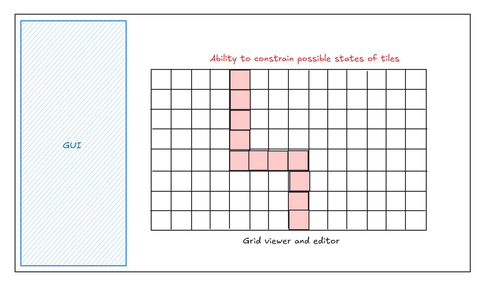

# CelesteWFC

## Introduction/motivations

I love Celeste. Everything about the game is great: the pixel art, the music, the gameplay, the story. One of the best parts of the game are the levels. They are designed so well and I can't believe that they're tile based because everything looks so natural.

Celeste is the perfect candidate for exploring wave function collapse, due to its reliance on a grid system. I always thought WFC sounded cool as heck and wanted to try implementing it on my own. I also wanted to get some more experience writing performant and modern C++ code, and setting up projects from scratch.

## Goal

- Learn in detail how wave function collapse works and how to implement it 
- Write modern and performant C++ code, practice structuring projects
- Work with/learn more OpenGL

## Inspiration/references

These links helped me decide on this project and will guide me through the process:

- [Celeste Tilesets, Step-by-Step (article)](https://aran.ink/posts/celeste-tilesets)
- [Why I use Wave Function Collapse to create levels for my game (video)](https://www.youtube.com/watch?v=TO0Tx3w5abQ)
- [Superpositions, Sudoku, the Wave Function Collapse algorithm. (video)](https://www.youtube.com/watch?v=2SuvO4Gi7uY)
- [EPC2018 - Oskar Stalberg - Wave Function Collapse in Bad North (video)](https://www.youtube.com/watch?v=0bcZb-SsnrA)
- [Paul Merrell, "Example-Based Model Synthesis" (2007)](https://paulmerrell.org/wp-content/uploads/2021/06/model_synthesis.pdf)
- [mxgnm / WaveFunctionCollapse (repo)](https://github.com/mxgmn/WaveFunctionCollapse)

## Specification

- C++ implementation of WFC
  - Ability to specify number of grid columns and rows
  - Ability to constrain certain tiles to a more limited number of states to begin with (e.g. forcing a path to be carved out)
  - Uses Celeste's Chapter 1 tileset, "Forsaken City"
- WFC editor
  - Edit output settings via a GUI
  - Ability to zoom in/out and pan around the WFC output
  - Ability to click a tile to select it and constrain its states

### Stretch goals

I have lots of ideas on additional features that I would like to explore if I have more time. Not too sure which ones are feasible:

- Ability to export/download finished output as a single image
- Generate more levels using different tilesets
- Performance improvements beyond the naive implementation
- Allowing the user to give an _example_ input which the algorithm uses instead to build its ruleset, generating levels from that instead
- Porting C++ code to WASM via something like [Emscripten](https://github.com/emscripten-core/emscripten) so that it can run in the browser

## Techniques

This project is specifically about wave function collapse so that's the algorithmic technique I'm focusing on. In particular, I'll be reading Paul Merell's specification from his original 2007 i3D paper (linked above) as well as Maxim Gumin's work, which introduced the name "wave function collapse" for the algorithm and popularized it (the original repo is also linked above).

I've already watched the videos I linked above. I think they provided me a more intuitive understanding of the repo and I'll probably revisit them if I become confused by the more technical jargon of the papers. Also, the video themselves reference the original papers and provide me a good overview of how/where to start.

The article on Celeste's tileset was useful in understanding the rules behind how Celeste laid out its levels. This will be used for developing the ruleset.

### Libraries

Building everything from scratch is impossible and isn't the focus of this project so I'll be using a few libraries that handle some aspects of this project:

- [GLFW](https://github.com/glfw/glfw) as a OpenGL wrapper and window context creation manager
- [ImGui](https://github.com/ocornut/imgui) for UI
- [nothings/stb](https://github.com/nothings/stb) for general utilities like image reading, etc.

## Design

This is how I imagine the application will look like:

## Timeline

- Milestone 1 (11/13)
  - Project and library setup
  - Working basic implementation with a simpler tileset (basic pipe-looking structures)
  - No GUI or customization, should just run on opening the app
- By 11/20
  - Add GUI, "generate" button
  - Adjust grid width and height
  - Ability to pan and zoom around 
- Milestone 2 (11/25)
  - Import Celeste's tileset and develop customized tileset
  - Ability to select a tile and edit its constraints (via the GUI most likely)
- Final (12/2)
  - Any of the stretch goals?
